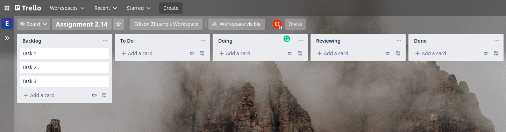

# Agile SCRUM: Assignment

## Brief

There are two parts to this assignment. 

In part 1, you are to set up a task tracker platform with you group. As your project week is drawing near, the task tracker platform will allow you to setup product backlog and sprint backlog.

In part 2, you are to venture into research online, engage in group discussion and then produce a personal conclusion for submission.

## Part 1 - Setup Task Tracker

You are recommended to use [Trello](https://trello.com/) for quick and simple setup. Everyone should create an account on Trello, but only one of you are required to setup the board (don't choose from template, just create a new board) and share the board with the rest of the group members. 

Once you are done, setup 5 columns:
1. Backlog (to add)
1. To Do (default)
1. Doing (default)
1. Reviewing (to add)
1. Done (default)

The result of it should look like this:



## Part 2 - Research and Discuss

Reflect on the [Agile Manifesto](https://agilemanifesto.org/), phrase them in no more than five sentences in your own words.

```
Individuals and interactions over processes and tools
Working software over comprehensive documentation
Customer collaboration over contract negotiation
Responding to change over following a plan

The Agile Manifesto is a document that identifies four key values and 12 principles that its authors believe software developers should use to guide their work flow management.
At regular intervals, the team reflects on how to become more effective, then tunes and adjusts its behavior accordingly.


```

Agile Methodology does not just apply to software development but any project management. Recollect the 12 principles of Agile and share which three principles are commonly violated in your experience and what can be done differently?

```
A))
1) Continuous Delivery
2)Welcome Changing Requirements
3)Deliver Working Software Frequently
4)Work Together Daily
5)Build Projects Around Motivated Individuals
6)Communication is Face-to-face
7)Working Software
8)Maintain a Sustainable Working Pace
9)Continuous Excellence Enhances Agility
10)Simplicity is Essential
11)Self-organizing Teams Generate Most Value
12)Regularly Reflect and Adjust Your Way of Work to Boost Effectiveness

B))
Self-organizing Teams Generate Most Value
Leaders should trust and give respect by giving them the space for decision making and do amendments. need not go up to leaders to seek permission. This may save time and builds a ownership responsibilities to the members.

Simplicity is Essential
Leaders should be humble and share the job completion with the team and not self proclaim 

Maintain a Sustainable Working Pace
Should allow team members to have a ballanced work live environment. 

```

What are the three roles that make up a SCRUM Team? Explain the function(s) of the three roles.

```
Product owner, Scrum master and the Development team members
```

What are the SCRUM Values? 

```
Commitment,
Focus,
Openness,
Respect, and.
Courage.
```

How many types of meetings are there in SCRUM? What is the purpose of each of them?
```

Sprint Planning Meeting:
The goal of this meeting is to develop realistic Sprint backlog and define the highest priority tasks which need to be done during the length of each Sprint.

Daily Scrum Meeting:
Well, there’s essentially a three questions agenda which is presented before each team member to get an overview of the task progress. 
These questions are:
- What did you accomplish yesterday?
- What are you working on today?
- Are there any impediments in your way?

Sprint Review Meeting:
The core objective of this meeting is to demonstrate the functionality of the product and what has been achieved during a particular Sprint.

Sprint Retrospective Meeting:
Sprint retrospective meeting- as the name suggests- is solely held with a fundamental purpose of reviewing what went right and wrong during a Sprint. The meeting brings forth a great opportunity for the entire team to reflect back on the work and what improvements are needed to be made.

Backlog Refinement Meeting:
In backlog refinement meeting, the backlog items are categorized and prioritized after a technical discussion with the team to make sure that the team understands what exactly are the deliverables and what are the requirements.

```

## Submission Guidelines

- Cite any relevant sources consulted during your research
- Solve the problems using your own code
- Do not copy and paste solutions from the source material
- Submit your assignment to black board.
